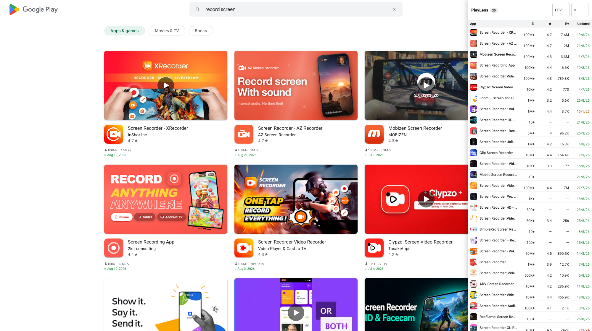

# PlayLens

**PlayLens – App Stats for Google Play**

[English](README.md) | Tiếng Việt · [Trang giới thiệu](https://fighttechvn.github.io/playlens/)

Chrome extension hiển thị **⬇ lượt tải · rating★ + số review · ⟳ ngày update gần nhất** cho mọi app trên các trang danh sách Google Play (trang developer, collection/cluster, tìm kiếm, trang chủ) — không cần mở từng app.



Ba chế độ hiển thị, bật/tắt độc lập bằng feature flag:

1. **Badge đè trên icon** — dải thông tin gọn ở đáy icon mỗi app (không làm vỡ layout). Tự ẩn khi bật chế độ 2 để cùng một con số không hiện hai lần trên một card.
2. **Inline dưới rating** — dòng nhỏ (`⬇100M+ · 824.1K rv` + `⟳ ngày update` tô màu) chèn ngay dưới dòng rating sẵn có của card.
3. **Panel bên phải** — panel cố định dạng **bảng**: App (icon + tên) · ⬇ tải · ★ rating · Rv review · Updated (`d/M/yy`, tô màu độ tươi). **Click tiêu đề cột để sort** (click lại để đảo chiều, có ▲/▼); click dòng để mở app. Nút **CSV** copy toàn bộ danh sách vào clipboard. Bật/tắt bằng nút 📊 nổi ở mép phải; trạng thái mở được ghi nhớ.

Panel có hai tab:

- **This page** — mọi app card tìm thấy trên trang đang mở. Ở trang chi tiết một app thì đó là các rail *Similar apps* và *More by …*, kèm chính app đang xem được ghim lên đầu bảng để so sánh trực tiếp.
- **Recent** — các app bạn đã mở trang chi tiết, mới nhất trước (tối đa 60), kèm thời gian đã xem. Danh sách lưu ngay trên máy bạn và không mất khi tắt trình duyệt; nút **Clear** xóa sạch, và có thể tắt hẳn tính năng này.

## Cài đặt

1. [Tải `playlens.zip`](https://github.com/fighttechvn/playlens/releases/latest/download/playlens.zip) và giải nén (hoặc clone repo này).
2. Mở `chrome://extensions`, bật **Developer mode**.
3. Bấm **Load unpacked**, chọn thư mục vừa giải nén.
4. Mở trang danh sách bất kỳ trên Google Play. Click icon extension trên toolbar để chỉnh flag.

## Đóng gói

```bash
./build.sh
```

Tạo `dist/playlens-v<version>.zip` (version đọc từ `manifest.json`, chỉ gồm file runtime, không có `.DS_Store`) — sẵn sàng upload Chrome Web Store hoặc chia sẻ. CI chạy đúng lệnh build này khi merge `develop` vào `uat` (xem `.github/workflows/build.yml`).

## Phát hành

Lần submit đầu lên Chrome Web Store phải làm tay — API không tạo được nội dung listing hay upload screenshot. Mọi thứ cần dán có sẵn ở [store/listing.md](store/listing.md).

Khi item đã tồn tại, các lần cập nhật version chỉ còn một lệnh:

```bash
./tools/publish.sh              # upload bản nháp
./tools/publish.sh --publish    # upload và gửi duyệt
```

Hoặc để CI làm — khi đã set 4 secret `CWS_*` trong repo, chỉ cần tạo GitHub release là workflow tự upload và gửi duyệt (`.github/workflows/publish.yml`).

Cách cài đặt cho cả hai đường (OAuth client, refresh token, item ID) ở [store/api-publishing.md](store/api-publishing.md).

## Nhánh & CI

- `main` — release (landing page trong `docs/` publish qua GitHub Pages)
- `develop` — phát triển hằng ngày
- `uat` — merge từ `develop` để test; mỗi push/merge vào `uat` sẽ kích hoạt GitHub Actions chạy `build.sh` và đính kèm file zip làm artifact của run.

## Feature flags (popup / trang cài đặt)

| Flag | Mặc định | Ý nghĩa |
|---|---|---|
| `overlay` | bật | Badge đè trên icon mỗi app (tự ẩn khi `inline` đang bật) |
| `inline` | bật | Dòng thông tin dưới rating sẵn có của card |
| `panel` | bật | Panel danh sách bên phải (kèm nút 📊) |
| `panelOpen` | tắt | Tự mở panel khi vào trang |
| `recent` | bật | Nhớ app đã mở trang chi tiết, hiện ở tab Recent của panel |

Flag lưu trong `chrome.storage.sync` và áp dụng **ngay lập tức** (content script lắng nghe `storage.onChanged` — không cần reload trang).

Ngoài popup nhanh còn có **trang cài đặt đầy đủ** (`options.html`): chuột phải icon extension → *Options*, hoặc bấm "⚙ Mở trang cài đặt đầy đủ" trong popup — công tắc từng flag kèm mô tả chi tiết, cùng nút **Xóa cache dữ liệu app** và **Xóa danh sách Recent**.

## Cách hoạt động

- Content script quét mọi thẻ `details?id=...` có chứa ảnh (app card). Với mỗi app, extension fetch trang chi tiết với `hl=en&gl=US` (label ổn định để parse) và trích:
  - **Tên app + rating + số review** — parse từ JSON-LD (`SoftwareApplication`): tên chuẩn và số review **chính xác** (vd 53,623 → `53.6K rv`)
  - **Lượt tải** — regex quanh label `Downloads` (vd `1M+`)
  - **Updated on** — ngày update, tô màu theo độ tươi: xanh ≤ 6 tháng, cam ≤ 18 tháng, đỏ nếu cũ hơn
- Badge chờ icon lazy-load tải xong mới gắn (tránh badge trôi trên ảnh cao 0px); bo góc copy theo icon.
- Mở trang chi tiết một app sẽ ghi app đó vào danh sách **Recent** trong `chrome.storage.local` (60 mục, mới nhất trước, không trùng package). Dữ liệu không rời khỏi trình duyệt; xóa từ panel hoặc trang cài đặt.
- Badge overlay được đo theo khung icon chứ không theo khung cha, nên vẫn nằm gọn trên icon ở cả dòng danh sách (rail của trang chi tiết) lẫn card dạng lưới; icon nhỏ hơn 96px chỉ giữ lượt tải và ngày rút gọn, vì card đã in sẵn rating ngay cạnh icon.
- Card ở trang tìm kiếm đặt ảnh chụp màn hình trước icon, nên badge chọn ảnh vuông (crop `=s<size>`) thay vì ảnh đầu tiên. Play còn render lại card tìm kiếm sau khi hiện, xóa mất phần chèn thêm và thuộc tính vị trí — mỗi lần quét lại sẽ gắn lại.
- Cache 12h trong `chrome.storage.local`, tối đa 3 fetch song song. Play là SPA → MutationObserver quét lại khi scroll/điều hướng; đổi trang sẽ reset danh sách panel.
- play.google.com áp CSP **Trusted Types** (cấm `innerHTML` kể cả với content script) → toàn bộ UI dựng bằng `createElement`/`textContent`.

## Hạn chế

- Việc parse phụ thuộc cấu trúc HTML của Play (JSON-LD + label `Downloads` / `Updated on`). Nếu Google đổi markup, cập nhật regex trong `content.js` (`fetchAppInfo`).
- App chưa có rating (quá mới) chỉ hiện lượt tải + ngày update.

## Giấy phép

[MIT](LICENSE) © [FightTech VN](https://github.com/fighttechvn)

---

PlayLens là dự án độc lập, không liên kết, không được Google bảo trợ hay chứng thực. Google Play là thương hiệu của Google LLC.
