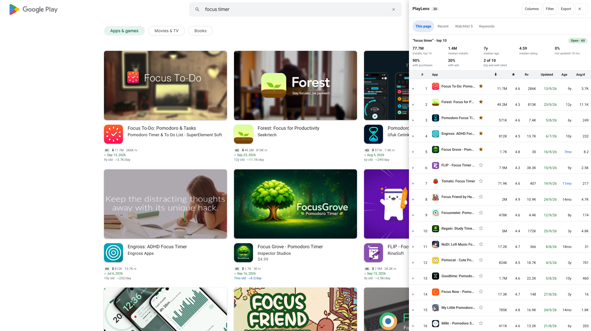

# PlayLens

**PlayLens – App Stats for Google Play**

[English](README.md) | Tiếng Việt · [Chrome Web Store](https://chromewebstore.google.com/detail/playlens-%E2%80%93-app-stats-for/hnhlkgnfbcijmnaaclpliogmmnflekko) · [Trang giới thiệu](https://fighttechvn.github.io/playlens/)

Chrome extension đưa **lượt cài chính xác · rating + số đánh giá · ngày update · tuổi app · lượt cài mỗi ngày** lên từng app trong các trang danh sách Google Play (tìm kiếm, trang nhà phát triển, collection, trang chủ, các rail ở trang chi tiết) — kèm một panel bên phải để so sánh, theo dõi và xuất dữ liệu.



## Tính năng

**Trên card**

- **Dòng thông tin dưới rating** — `#2 ⬇49.2M · 813K rv`, `⟳ Sep 23, 2026` (xanh ≤ 6 tháng, cam ≤ 18 tháng, đỏ nếu cũ hơn), `12y old · ~11.1K/day`. App ra mắt trong 30 ngày được in đậm trên nền màu, app dưới 1 năm được tô màu.
- **Badge đè trên icon** — cùng các con số, dạng dải ở đáy icon, cho ai thích kiểu này (tự ẩn khi đang bật dòng thông tin, để không hiện trùng).
- **Số thứ hạng** trên trang tìm kiếm (`#1`, `#2`…), theo đúng thứ tự card đang hiển thị.

**Trong panel** (nút 📊 ở mép phải)

| Tab | Nội dung |
|---|---|
| **This page** | Bảng mọi app trên trang. Bấm tiêu đề cột để sắp xếp, **Columns** để chọn cột, **Filter** để lọc (card bị loại cũng mờ đi trên trang), **Export** để copy hoặc tải CSV / JSON đủ 36 trường. Ở trang chi tiết một app, chính app đó được ghim trên đầu danh sách *Similar apps*. |
| **Recent** | Các app bạn đã mở trang chi tiết, mới nhất trước (tối đa 60). |
| **Watchlist** | Các app bạn gắn sao (☆). Cho biết điều gì đã đổi từ lần xem trước — version, tên, giá, rating — và lượt cài mỗi ngày đo từ số liệu ghi hằng ngày. |
| **Keywords** | Gợi ý tìm kiếm của chính Play cho một từ (tùy chọn thêm từng chữ cái a–z phía sau), mỗi từ khóa được chấm điểm độ "mở". |

Phía trên bảng là phần **tổng kết**: ở trang tìm kiếm là 10 kết quả đầu (tổng và trung vị lượt cài, trung vị tuổi và rating, tỉ lệ có mua trong app / quảng cáo, tỉ lệ không update quá 18 tháng) cùng kết luận *Open / Contested / Crowded*; ở trang nhà phát triển là toàn bộ danh mục app của họ.

**▸ Chi tiết một app** — lượt cài chính xác bên cạnh mốc của Play, ngày ra mắt, lượt cài mỗi ngày (tính từ lúc ra mắt và đo thực tế), tỉ lệ đánh giá trên lượt cài, phân bố 1–5★ kèm tỉ lệ 1–2★, giá / mua trong app / quảng cáo, thể loại, version, Android tối thiểu, nhãn an toàn dữ liệu, email và website nhà phát triển (có nút copy), ảnh chụp màn hình trên store, link sang AppBrain, APKMirror và App Store. Khi bạn bấm: **Compare countries** (mỗi quốc gia một yêu cầu) và **Low-star reviews** — các review 1–3★ mới nhất kèm những từ xuất hiện nhiều, cùng chức năng xuất review lọc theo số sao và ngày. Tên người viết review được cố ý bỏ ra.

## PlayLens Pro (tuỳ chọn, trả phí)

Mọi thứ ở trên vẫn **miễn phí**. Pro thêm những thứ tốn công theo thời gian hoặc chạy nền:

| | Free | Pro |
|---|---|---|
| **Rank tracker** — theo dõi một từ khoá ở một quốc gia cho app trong Watchlist; mỗi ngày service worker kiểm tra và vẽ vị trí theo thời gian | 3 cặp | 150 cặp, 90 ngày |
| **Cảnh báo** — thông báo desktop khi từ khoá lên/xuống hạng hoặc app đang theo dõi đổi version, giá, rating | — | ✓ (xin quyền tuỳ chọn `notifications`) |
| **So sánh app** — chọn app trong bảng (⇄), bảng cạnh nhau, biểu đồ lịch sử cài đặt và rating | 2 app, không biểu đồ | tới 6 app + biểu đồ |
| **Báo cáo** — một file HTML/Markdown về thay đổi của Watchlist trong 7 / 30 / 90 ngày | — | ✓ |
| **Sao lưu và khôi phục** Watchlist, lịch sử và thứ hạng | — | ✓ |
| **Danh sách từ khoá** — lưu bộ từ khoá, *Score all*, điểm cơ hội theo quốc gia | chấm 10 từ đầu | không giới hạn, 20 danh sách |

Pro bán qua [Polar](https://polar.sh) (merchant of record: lo thanh toán, thuế, hoàn tiền); bạn nhận khoá bản quyền qua email và dán vào trang cài đặt. Khoá được kiểm tra với `api.polar.sh` khoảng mỗi ngày (tối đa 3 trình duyệt mỗi khoá); mất mạng hai tuần vẫn dùng được Pro. Đây là sự tiện lợi và cách ủng hộ dự án, không phải DRM — mã nguồn MIT, ai cũng đọc được cách kiểm tra.

**Thiết lập (người bảo trì).** Tạo sản phẩm trong Polar (Monthly / Yearly / Lifetime) kèm benefit *License Keys* (tiền tố `PLAY-`, 3 lượt kích hoạt), rồi điền `CONFIG.ORG_ID` và `CONFIG.CHECKOUT` trong [`license.js`](license.js) và `CHECKOUT` trong `docs/index.html`. Thử trước trên sandbox của Polar bằng cách đặt `CONFIG.API` là `https://sandbox-api.polar.sh`. Đề xuất và số liệu ở [research/PREMIUM.md](research/PREMIUM.md). Khi chưa điền id, trang cài đặt ghi "sắp mở bán" và không gửi gì tới Polar.

**Chạy nền** — khoảng 6 giờ một lần, service worker đọc lại trang của các app trong Watchlist và hiện số app có thay đổi lên icon tiện ích. Watchlist trống thì không có yêu cầu nào được gửi, và có thể tắt hẳn.

Điều PlayLens không làm: ước tính doanh thu. Con số đó không đọc được từ trang công khai nên PlayLens không đoán.

## Cài đặt

[**Cài từ Chrome Web Store**](https://chromewebstore.google.com/detail/playlens-%E2%80%93-app-stats-for/hnhlkgnfbcijmnaaclpliogmmnflekko) — rồi mở trang danh sách bất kỳ trên Google Play. Click icon extension trên toolbar để chỉnh flag.

Muốn chạy từ mã nguồn:

1. [Tải `playlens.zip`](https://github.com/fighttechvn/playlens/releases/latest/download/playlens.zip) và giải nén (hoặc clone repo này).
2. Mở `chrome://extensions`, bật **Developer mode**.
3. Bấm **Load unpacked**, chọn thư mục vừa giải nén.

## Đóng gói

```bash
./build.sh
```

Tạo `dist/playlens-v<version>.zip` (version đọc từ `manifest.json`, chỉ gồm file runtime, không có `.DS_Store`) — sẵn sàng upload Chrome Web Store hoặc chia sẻ. CI chạy đúng lệnh build này khi merge `develop` vào `uat` (xem `.github/workflows/build.yml`).

## Phát hành

Extension đã lên store với item `hnhlkgnfbcijmnaaclpliogmmnflekko`; nội dung listing đã nộp lưu ở [store/listing.md](store/listing.md). Lần submit đầu phải làm tay vì API không tạo được listing hay upload screenshot, còn từ giờ mỗi lần cập nhật version chỉ còn một lệnh:

```bash
./tools/publish.sh              # upload bản nháp
./tools/publish.sh --publish    # upload và gửi duyệt
```

Hoặc để CI làm — khi đã set 4 secret `CWS_*` trong repo, chỉ cần tạo GitHub release là workflow tự upload và gửi duyệt (`.github/workflows/publish.yml`).

Cách cài đặt cho cả hai đường (OAuth client, refresh token, item ID) ở [store/api-publishing.md](store/api-publishing.md).

## Nhánh & CI

- `main` — release (landing page trong `docs/` publish qua GitHub Pages)
- `develop` — phát triển hằng ngày
- `uat` — merge từ `develop` để test; mỗi push/merge vào `uat` sẽ kích hoạt GitHub Actions chạy `build.sh`, đính kèm zip làm artifact của run, đồng thời cập nhật **pre-release `uat`** để người test có link tải không cần đăng nhập GitHub:

  ```
  https://github.com/fighttechvn/playlens/releases/download/uat/playlens-uat.zip
  ```

  Tag `uat` được tạo lại mỗi lần build nên link luôn trỏ bản mới nhất. Pre-release không kích hoạt workflow đẩy lên Chrome Web Store — chỉ release chính thức `vX.Y.Z` mới lên store.

## Cài đặt hiển thị (popup / trang cài đặt)

| Flag | Mặc định | Ý nghĩa |
|---|---|---|
| `overlay` | bật | Badge đè trên icon mỗi app (tự ẩn khi `inline` đang bật) |
| `inline` | bật | Dòng thông tin dưới rating sẵn có của card |
| `panel` | bật | Panel bên phải (kèm nút 📊) |
| `panelOpen` | tắt | Tự mở panel khi vào trang |
| `recent` | bật | Nhớ app đã mở trang chi tiết, hiện ở tab Recent |
| `exact` | bật | Lượt cài chính xác (`49.2M`) thay cho mốc của Play (`10M+`) |
| `age` | bật | Tuổi app và lượt cài mỗi ngày trên card |
| `rank` | bật | Số thứ hạng trên card tìm kiếm, trong bảng và file xuất |
| `history` | bật | Ghi số liệu mỗi app tối đa một lần một ngày, để đo tăng trưởng |
| `bgRefresh` | bật | Tự cập nhật Watchlist ở nền, khoảng 6 giờ một lần |
| `alerts` | tắt | Pro: thông báo desktop (bật sẽ xin quyền `notifications`) |

Ngoài ra còn lưu `cols` (các cột của bảng) và `countries` (mã quốc gia 2 chữ cái cho *Compare countries* và tab Keywords, tối đa 8; mặc định `US, GB, DE, JP, VN`).

Cài đặt lưu trong `chrome.storage.sync` và áp dụng **ngay lập tức** (content script lắng nghe `storage.onChanged` — không cần reload trang).

Ngoài popup nhanh còn có **trang cài đặt đầy đủ** (`options.html`): chuột phải icon extension → *Options*, hoặc bấm "⚙ Mở trang cài đặt đầy đủ" trong popup. Trang này cho biết đang lưu bao nhiêu dữ liệu và có nút xóa riêng cho từng loại: cache, Recent, lịch sử số liệu, Watchlist.

## Cách hoạt động

- `core.js` chứa mọi thứ chạy được mà không cần trang web — parse, định dạng, chấm điểm — dùng chung cho content script và service worker. `node tools/test-core.js` kiểm tra nó với trang Play thật; `node tools/test-pro.js` kiểm tra hàm Pro và logic khoá bản quyền ngoại tuyến. `license.js` chứa các lệnh gọi Polar và giới hạn Free/Pro.
- Content script quét mọi thẻ `details?id=...` có chứa ảnh (app card). Với mỗi app, extension fetch trang chi tiết với `hl=en&gl=US` (label ổn định) và đọc khối dữ liệu listing trong `AF_initDataCallback`: lượt cài chính xác, phân bố rating, ngày ra mắt, giá, mua trong app, quảng cáo, thể loại, version, liên hệ nhà phát triển, ảnh chụp màn hình, an toàn dữ liệu.
- Review và gợi ý tìm kiếm lấy từ đúng endpoint `batchexecute` mà trang Play tự gọi. Chỉ gửi yêu cầu khi bạn bấm.
- **Điểm cơ hội** của một từ khóa là `0.35 × nhu cầu + 0.30 × kiếm tiền + 0.25 × cạnh tranh + 0.10 × điểm yếu`, tính từ 10 kết quả đầu: ≥ 60 *Open*, 45–59 *Contested*, thấp hơn là *Crowded*. Đây là cách xếp thứ tự ý tưởng, không phải dự báo.
- Cache 12h trong `chrome.storage.local`, tối đa 3 fetch song song. Lưu theo khóa `app:<id>` (cache), `h:<id>` (số liệu hằng ngày, tối đa 200), `w:<id>` (mục Watchlist), `kw:<id>` (thứ hạng của app đang theo dõi), `cc:<id>:<gl>` (so sánh quốc gia).
- Play là ứng dụng một trang (SPA) nên có vài điểm phải xử lý:
  - Play vẽ lại card tìm kiếm ngay sau khi hiện, xóa mất phần chèn thêm và dấu đánh — mỗi lần quét lại sẽ gắn lại lên đúng card.
  - Play giữ trang cũ trong tài liệu ở trạng thái ẩn để nút Back chạy tức thì. Card không hiển thị (`checkVisibility()`) được bỏ qua, app không còn trên trang sẽ rời khỏi bảng, và thứ hạng là thứ tự card đang thấy trên màn hình.
- Dòng thông tin nằm trên trang của Play nên màu chữ theo nền của trang; panel thì theo giao diện sáng/tối của hệ thống.
- play.google.com áp CSP **Trusted Types** (cấm `innerHTML` kể cả với content script) → toàn bộ UI dựng bằng `createElement`/`textContent`, SVG bằng `createElementNS`.

## Hạn chế

- Việc parse phụ thuộc vị trí các trường trong dữ liệu trang của Play. Nếu Google đổi chỗ, `node tools/test-core.js` sẽ chỉ ra trường nào hỏng; các đường dẫn nằm trong `core.js` (`parseDetail`).
- Lượt cài mỗi ngày *từ lúc ra mắt* là trung bình cả vòng đời app. Con số *đo thực tế* cần ít nhất hai lần ghi số liệu khác ngày, nên có từ ngày thứ hai trở đi.
- App chưa có rating (quá mới) chỉ hiện lượt cài và ngày tháng.
- Link sang AppBrain được ghép từ tên package; AppBrain có trang cho app đó hay không là tùy AppBrain.

## Giấy phép

[MIT](LICENSE) © [FightTech VN](https://github.com/fighttechvn)

---

PlayLens là dự án độc lập, không liên kết, không được Google bảo trợ hay chứng thực. Google Play là thương hiệu của Google LLC.
